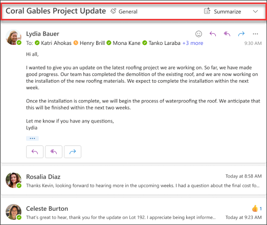

# 使用 Outlook 中的 Copilot 赶上并准备本周工作

Outlook 中的 Copilot 通过 AI 提供支持的帮助来让你更轻松地管理收件箱，帮助你快速编写电子邮件，并将长电子邮件讨论主题转换为简短摘要。 它将大型语言模型 (LLM) 的强大功能与 Outlook 数据相结合，帮助你在工作场所保持工作效率。 它可以汇总电子邮件讨论主题（也称为对话），可以从多个消息中提取关键点。

在电子邮件上下文中选择“**让 Copilot 做摘要**”时，Copilot 会自动根据讨论主题提供摘要。 常见用例汇总了一封长电子邮件，以查看已做出哪些决策，以及讨论主题中的其他人建议了哪些行动项。

完成后，摘要将显示在电子邮件顶部，还将包含编号引文，选中后，会将你带到讨论主题中的相应电子邮件上。

## 我们开始撰写

从 Outlook 的工具栏中打开 Copilot 窗格，然后按照提示操作，而不是使用基本汇总功能。 但是，电子邮件的具体情况会有所不同，你需要根据自己的情况调整提示。

> [!NOTE]
> 启动撰写提示：
>
> _总结此电子邮件对话。_

在这一简单提示中，首先设定基本**目标**：_总结电子邮件对话。_ 但是，没有任何信息说明你为什么需要摘要或要查找什么内容。

| 元素 | 示例 |
| :------ | :------- |
| **基本提示：** 从一个“**目标**”开始 | **总结此电子邮件对话。** |
| **良好提示：** 添加“**上下文**” | 添加**上下文**可以帮助 Copilot 了解目的并相应地调整响应。 _“我需要一份有关分配给我的操作项的简要概述...”_ |
| **更好的提示：** 指定“**来源**” | 添加**来源**可帮助 Copilot 了解需要汇总哪个部分并提供更准确的响应。 _“...来自周四发送的项目计划。”_ |
| **最佳提示：** 设置明确的“**预期**” | 最后，添加**期望**可以帮助 Copilot 了解如何设置摘要的格式以及所需的详细程度。 _“创建包含所有拟办事项和已分配负责人的表，并突出显示分配给我的拟办事项。”_ |

> [!NOTE]
> **精心制作的提示：**
>
> _总结此电子邮件对话。我需要来自周四发送的项目计划中向我分配的操作项的简要概述。创建包含所有操作项和已分配负责人的表，并突出显示分配给我的操作项。_

在此提示中，Copilot 拥有给出可靠答案所需的一切信息，这要归功于此提示中的**目标**、**上下文**、**源**和**预期**。

> [!IMPORTANT]
> Outlook 中的 Copilot 目前仅支持工作或学校帐户，以及使用 outlook.com、hotmail.com、live.com 和 msn.com 电子邮件地址的 Microsoft 帐户。 任何使用第三方电子邮件提供程序帐户的 Microsoft 帐户（如 Gmail、Yahoo 或 iCloud）仍可以使用 Outlook，但无法访问 Outlook 中的 Copilot 功能。 有关详细信息，请参阅[在 Outlook 中使用 Copilot 汇总电子邮件线程](https://support.microsoft.com/office/summarize-an-email-thread-with-copilot-in-outlook-a79873f2-396b-46dc-b852-7fe5947ab640)
