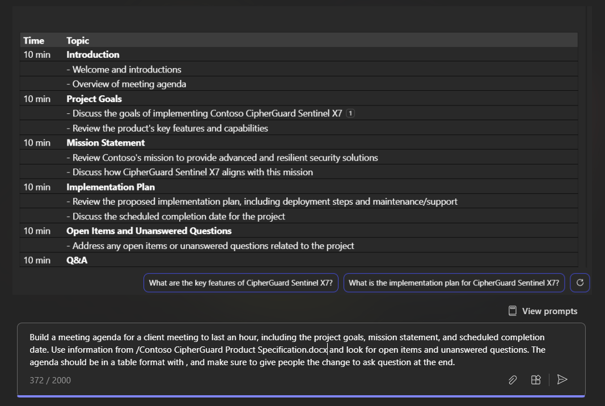

# 使用 Microsoft 365 Copilot Chat 集思广益，讨论新创意、列表和报表

Microsoft 365 Copilot Chat  (Copilot Chat) 将人工智能 (AI) 的强大功能与工作数据和应用相结合，帮助你释放创造力、提升工作效率和升级技能。 它适用于多个应用和内容，让你拥有 AI 的强大功能以及安全的工作数据。 它能够一次性合成信息并从多个来源创建内容，使你能够处理更广泛的目标和目的。

相比之下，不同 Microsoft 365 应用（如 Word 或 PowerPoint）中的 Copilot 是经过专门设计的，可**在该应用内**为你提供帮助。 例如，Word 中的 Copilot 旨在帮助你更好地起草、编辑和使用内容。 在 PowerPoint 中，可帮助你创建更好的演示文稿。 但有了 Copilot Chat，我们就能将这一切整合为一种全新的体验。

可以通过多种方式访问 Copilot Chat：

- 在 Microsoft Teams 的桌面和移动版本中使用 Copilot。 请参阅[使用 Teams 中的 Copilot Chat](https://support.microsoft.com/topic/open-microsoft-365-chat-in-teams-c6de0a62-4f9e-479d-b5f2-af036e342181)。

- 在 Microsoft.com/Copilot 上访问 Copilot Chat。 请参阅 [使用 Microsoft365.com/copilot 上的 Copilot Chat](https://support.microsoft.com/topic/use-microsoft-365-chat-at-microsoft365-com-or-in-the-microsoft-365-office-app-4a2538f9-962f-4c7c-a368-f6006bc13d6f)。

## 我们开始撰写

使用上一单元中的 **Contoso CipherGuard Product Specification.docx**，打开 Teams 中的 Copilot Chat 以处理下一个提示。

> [!NOTE]
> 启动撰写提示：
>
> _制定会议议程。_

在这一简单提示中，首先设定基本**目标**：_制定会议议程_。 但是，没有关于会议的目的或目标的信息。

| 元素 | 示例 |
| :------ | :------- |
| **基本提示：** 从一个“**目标**”开始 | **_生成会议议程。_** |
| **良好提示：** 添加“**上下文**” | 添加“**上下文**”可帮助 Copilot 了解召开会议的原因以及要讨论的内容。 _“...针对一场客户会议，会议将持续一个小时，纳入项目目标、宗旨声明和预定完成日期。”_ |
| **更好的提示：** 指定“**来源**” | 添加**来源**可帮助 Copilot 了解在何处查找特定信息。 _“使用取自 **/Contoso CipherGuard Product Specification.docx** 的信息，并查找未完成项和未回答的问题。”_ |
| **最佳提示：** 设置明确的“**预期**” | 最后，添加**期望**可帮助 Copilot 了解你希望如何编写和格式化文档。 _“该议程应采用具有时间分配的表格格式，并确保在最后给人们提问的机会。”_ |

> [!NOTE]
> **精心制作的提示：**
>
> _制定一场客户会议的会议议程，会议将持续一个小时，包括项目目标、宗旨声明和预定完成日期。使用 **/Contoso CipherGuard Product Specification.docx** 中的信息，并查找未完成项和未回答的问题。该议程应采用具有时间分配的表格格式，并确保在最后给人们提问的机会。_

查看议程并进行任何调整或优化，然后将其添加到 Teams 中的会议邀请。

### 引用源

与示例中一样，如果希望 Copilot 基于文件、会议或人员（甚至全部三项）新建演示文稿，则可以告诉它执行此操作。 在提示窗口中，只需开始键入正斜杠“/”，弹出窗口便会提供要引用的最近的会议、文件或人员。

> [!IMPORTANT]
> 你必须有权访问所引用的文件，无论这些文件位于组织的 SharePoint 还是 OneDrive 中，是 Word、Excel 还是 PowerPoint 格式。

## 浏览更多

下面是你可能想要试用的提示的一些建议。 复制或修改这些文件以满足自己的需求。

- 上次会议中发生了什么情况？

- 查看未读聊天。

- 起草一条消息，说明 OKR 将于下周到期。

- 告诉我的团队如何更新产品策略。

- 总结昨晚发生的有关[客户]升级事件的聊天、电子邮件和文档。

- [项目]的下一个里程碑是什么？ 是否存在任何风险？ 帮助我集思广益，列出一些可能的缓解方法。

- 以[文件]的样式撰写规划概述，其中包含[另一个文件]中的日程表，并纳入来自[人员]电子邮件中的项目列表。
