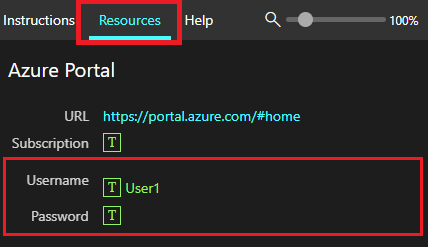

# 练习 - 将示例数据与 Microsoft 365 Copilot 配合使用

在整个模块中，我们将为 Microsoft 365 Copilot 创建引用以下文件的提示：

- [Graphic Design Institute - 员工福利.docx](https://go.microsoft.com/fwlink/?linkid=2268825)
- [神秘香料特级柴茶市场分析演示文稿.pptx](https://go.microsoft.com/fwlink/?linkid=2268768)
- [Fabrikam Q1 市场营销活动.xlsx](https://go.microsoft.com/fwlink/?linkid=2269124)

**备注**：以下是我们将在整个模块中引用的文件。 但是，对于此实验室，我们首先要将所有文件上传到 **OneDrive**，以确保稍后 Copilot 提示可以访问这些文件。

## 将文件上传到 OneDrive

按照以下步骤将所需的所有文件上传到 **OneDrive**：

1. 使用本地**管理员**帐户和密码 `Pa55w.rd` 登录到租户提供程序提供的虚拟机。
2. 在 Windows 任务栏上，选择“**Microsoft Edge**”。
3. 在地址栏中输入`https://www.office.com`。
4. 在“**欢迎使用 Microsoft 365**”下，选择“**登录**”。
5. 在“**登录提示符**”处，输入 `userx@yourtenant.onmicrosoft.com`（租户提供程序提供的用户名和租户），然后选择“**下一步**”。

    

6. 在“**输入密码**”屏幕上，输入用户帐户的密码（由租户提供程序提供），然后选择“**登录**”。
7. 如果系统提示“**保持登录**”，请选择“**不再显示**”，然后选择“**是**”。
8. 在 **Microsoft 365** 中，选择“**应用**”。
9. 在“**应用**”中，选择“**OneDrive**”。
10. 在 **OneDrive** 的左上角，选择“**+**”（添加新的）>“**文件上传**”。
11. 在**文件资源管理器**中，选择“**此电脑**” > “**本地磁盘 (C:)**”并打开 **ResourceFiles** 文件夹。
12. 选择 **ResourceFiles** 文件夹中的所有文件，然后选择“**打开**”以将其上传到 **OneDrive**。
13. 上传完成后，应该会在屏幕底部中央看到“**已上传 29 个项目到‘我的文件’**”。
14. 保持 **Edge** 打开，然后继续执行下一个任务。

### 引用文件

从 Copilot 引用文件时，你可能会发现，无法从提供的建议中找到某些文件。 有时会出现这种情况，因为 Copilot 的某些体验只能引用最近使用 (MRU) 列表中的文件，而其他体验则可以让你浏览 OneDrive 查找文件。 将它们添加到该列表非常简单，就像在相应的 Microsoft 365 应用中打开它们一样简单。  打开后，它们应显示在 MRU 列表中。

> [!IMPORTANT]
> Microsoft 365 Copilot 将仅处理保存到 OneDrive 的文件。 如果文件存储在本地电脑上，则需要将其移动到 OneDrive 才能激活 Copilot。

随着本模块的深入，你将有机会根据这些文件尝试其他提示，我们鼓励你这样做，以探索和提高提示技能。
