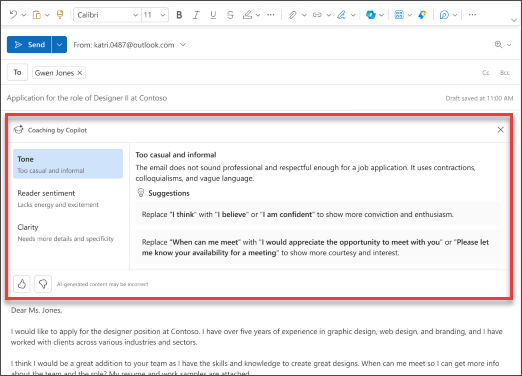

# 使用 Outlook 中 Microsoft 365 Copilot 重写邮件，调整回复的语气

有一封重要的电子邮件要写，并希望确信它有效地传达了你预期的信息？ 借助 Outlook 中的 Copilot，你可以在发送电子邮件前，获得如何调整邮件语气、内容清晰度和关照读者情绪等方面的有用建议。

1. 在 Outlook 中，选择 **“开始”>“新建邮件”>“邮件”**。 输入电子邮件内容。

1. 从顶部工具栏中选择 **Copilot** 图标。 从下拉菜单中选择 **Copilot 指导**。

    

1. Copilot 会审视该邮件，并提供有关如何改善语气、内容清晰度和照顾读者情绪等方面的建议。

1. 如果喜欢任一建议或全部建议，请将反馈合并到草稿之中。 觉得满意后，再发送电子邮件。

    

在以下示例中，我们从简单的提示开始，然后在此过程中添加元素。 使用 Copilot 起草电子邮件后，按照示例进行操作。

## 我们开始撰写

**首先，要求 Outlook 中的 Copilot 使用以下提示起草虚构的电子邮件**：  

> _为客户起草有关我们最新软件版本的简短产品更新公告。强调关键新功能、改进以及它们如何使用户受益。_  

> [!NOTE]
> 启动撰写提示：
>
> _查看此电子邮件并提出改进建议。_

在此简单提示中，首先从基本“**目标**”开始：_改进电子邮件_。 但是，关于需要进行哪些改进，却没有太多详细说明。  

| 元素 | 示例 |
| :------ | :------- |
| **基本提示：** 从一个“**目标**”开始 | **_使此电子邮件更加正式。_** |
| **良好提示：** 添加“**上下文**” | 添加“**上下文**”有助于 Copilot 了解电子邮件的目的以及需要哪种类型的改进。 _“...因此，它听起来更专业、更精致，同时保持温暖和引人入胜的语气。”_ |
| **更好的提示：** 指定“**来源**” | 此提示的“**来源**”是已在 Outlook 中起草的电子邮件。 _“...此电子邮件。”_ |
| **最佳提示：** 设置明确的“**预期**” | 添加“**期望**”有助于 Copilot 了解所需的更改。 _“确保电子邮件专业、简洁，并清楚地突出显示产品更新的关键详细信息。”_ |

> [!NOTE]  
> **精心制作的提示：**  
>
> _确保电子邮件专业、简洁，并清楚地突出显示产品更新的关键详细信息。_  

此提示为 Copilot 提供满意答案所需的一切信息，包括**目标**、**上下文**、**源**和**预期**。
