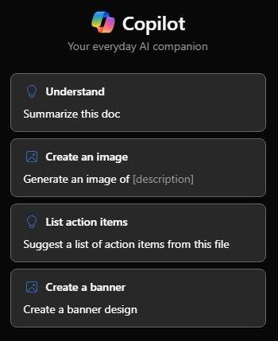

# 向 Word 中的 Microsoft 365 Copilot 寻求帮助和建议

若要在 Word 中与 Copilot 聊天，可以通过选择功能区的“**开始**”选项卡中的 Copilot 图标来打开“**Copilot**”窗格。

除了创建内容或生成创意之外，Word 中的 Copilot 还能处理你正在阅读的文档的各种问题。 一旦 Copilot 响应提示后，还可以查看来自 Copilot 从文档中提取信息后的引文引用。

## 询问有关本文档相关的问题

- 本文档之总结 - 需要快速了解文档的精髓？ 在 Copilot 聊天窗格中输入“汇总本文档”，以获取针对文档的按项目符号列明的摘要内容。

- 是否有行动号召？ - 想知道文档是否包含有意义的行动号召？ 向 Copilot 询问，它会试图告诉你。

## 提出开放式问题

想要向文档添加一些内容或上下文？ 全面向 Copilot 询问问题，它会努力给出答案。 例如：

- 如何编辑此文档，使其更学术化？

- 有没有美国总统关于勇气的名言？

如果文档中没有这些答案，Copilot 将使用底层大型语言模型生成答案。 如果你找到了希望使用的内容，并想要将其添加到文档中，只需在 Copilot 窗格内复制该内容并粘贴到文档中即可。

## 我们开始撰写

首先，下载**_[神秘香料臻品印度奶茶市场分析报告.docx](https://go.microsoft.com/fwlink/?linkid=2268826)_**，如果尚未保存，请将该文件保存到 **OneDrive 文件夹**中。

在 Word 中打开文档，然后通过选择功能区“**开始**”选项卡中的 Copilot 图标打开“**Copilot**”窗格。输入下面的提示，然后继续操作。

> [!NOTE]
> 启动撰写提示：
>
> _是否有行动号召？_

在这个简单的提示中，首先从基 **目标**开始：_在文档中找到有意义的行动号召。_ 但是，你仍然没有说明_为什么_需要此信息。

| 元素 | 示例 |
| :------ | :------- |
| **基本提示：** 从一个“**目标**”开始 | **_是否有行动号召？_** |
| **良好提示：** 指定“**来源**” | 添加**来源**可帮助 Copilot 了解在何处查找特定信息。 _“...在此市场分析报告中...”_ |
| **更好的提示：** 添加“**上下文**” | 添加**上下文**可以帮助 Copilot 根据上下文进行响应，并提供更有针对性的响应。 _“...来应对我们的挑战和担忧。请检查营销计划是否包含明确、具体的行动计划，例如促销计划或限时折扣。”_ |
| **最佳提示：** 设置明确的“**预期**” | 最后，添加**期望**可以帮助 Copilot 准确了解你的需求，而不仅仅是给出一个简单的_是_或 _否_的回答。 _“如有必要，请提供改进行动号召的建议。”_ |

> [!NOTE]
> **精心制作的提示：**
>
> _此市场分析报告中是否有行动号召来应对我们的挑战和担忧？请检查营销计划是否包含明确、具体的行动计划，例如促销计划或限时折扣。如有必要，请提供改进行动号召的建议。_

此提示为 Copilot 提供满意答案所需的一切信息，包括**目标**、**上下文**、**源**和**预期**。

> [!IMPORTANT]
> 拥有 Microsoft 365 Copilot 许可证或 Copilot Pro 许可证的客户可使用此功能。 有关详细信息，请参阅[与 Copilot 讨论你的 Word 文档](https://support.microsoft.com/office/chat-with-copilot-about-your-word-document-4482c688-a495-4571-bfcd-4a9fc6608090)。
