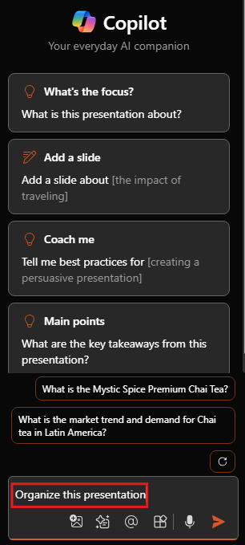

# 使用 PowerPoint 中的 Microsoft 365 Copilot 获取设计和整理技巧

要在 PowerPoint 中开始与 Copilot 聊天，可以在功能区的“**开始**”选项卡中选择 Copilot 图标来打开“**Copilot**”窗格。

创建演示文稿时，或许无法确定如何将幻灯片分配到各章节中。 PowerPoint 中的 Copilot 可以提供帮助。 可以让 Copilot 来组织演示文稿。 幻灯片会被组织成各个章节，然后对各章节添加标题。

1. 在功能区中，选择“Copilot”按钮。

1. Copilot 窗格会在屏幕右侧会打开。

1. 在 Copilot 窗格底部的提示字段中，输入 **“整理此演示文稿”**。

1. 选择**Send**。

如果对 Copilot 执行的操作感到不满意，只需选择功能区上的 **“撤消”按钮**即可将幻灯片组还原到之前的状态。

## 我们开始撰写

如果尚未执行此操作，请下载以下文件，并将该文件保存到 **OneDrive 文件夹**，使其显示在 MRU 列表中：

- **_[神秘香料特级柴茶市场分析演示文稿.pptx](https://go.microsoft.com/fwlink/?linkid=2268768)_**
- **_[神秘香料特级柴茶产品介绍.docx](https://go.microsoft.com/fwlink/?linkid=2268929)_**

> [!NOTE]
> 启动撰写提示：
>
> _组织此 PowerPoint 演示文稿。_

在此简单提示中，从基本**目标**开始：_整理 PowerPoint_。 但是，没有关于为何需要总结演示文稿或需要摘要的信息。

| 元素 | 示例 |
| :------ | :------- |
| **基本提示：** 从一个“**目标**”开始 | **组织此 PowerPoint 演示文稿。** |
| **良好提示：** 添加“**上下文**” | 添加**上下文**有助于 Copilot 理解组织幻灯片的方式以及执行此操作的原因。 _“…用于下周的执行产品评审”_ |
| **更好的提示：** 指定“**来源**” | 添加**源**有助于 Copilot 查找特定位置，例如产品规格或目录。 _“请参阅 **/Mystic Spice Premium Chai Tea product description.docx **了解相关产品信息。”_ |
| **最佳提示：** 设置明确的“**预期**” | 最后，添加**预期** 有助于 Copilot 理解如何构建演示文稿以及要包含的详细信息级别。 _“按产品排列幻灯片，并包含概述、主要功能和优势列表、客户反馈以及与市场上同类产品的比较。”_ |

> [!NOTE]
> **精心制作的提示：**
>
> _组织此演示文稿，供下周进行执行产品评审。请参阅 **/神秘香料特级茶产品介绍.docx** 获取产品信息。按产品排列幻灯片，并包括概述、关键功能和优势列表、客户反馈以及与市场上同类产品的比较。_

在此提示中，提供了“**目标**”、“**上下文**”、“**来源**”和“**期望**”，这为 Copilot 提供足够的指引，从而能生成满足你的需求的回复。

## 浏览更多

试用我们创制的最终提示，但要使用自己的 PowerPoint 演示文稿。 自定义“**上下文**”、“**源**”和“**期望**”，以便从演示文稿中获取所需内容，而无需任何额外的内容。

> [!IMPORTANT]
> 拥有 Microsoft 365 Copilot 许可证或 Copilot Pro 许可证的客户可使用此功能。 有关详细信息，请参阅[在 PowerPoint 中使用 Copilot 组织此演示文稿](https://support.microsoft.com/office/organize-this-presentation-with-copilot-in-powerpoint-a207eea3-7a56-4225-88f1-54dd37cdcf6a)。
